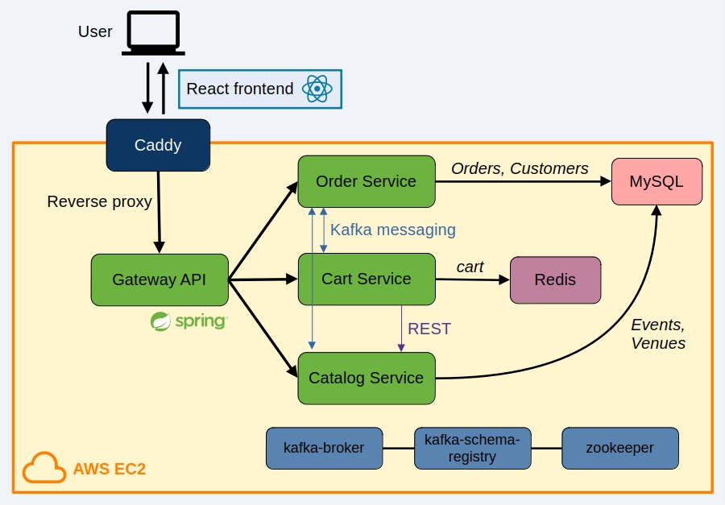
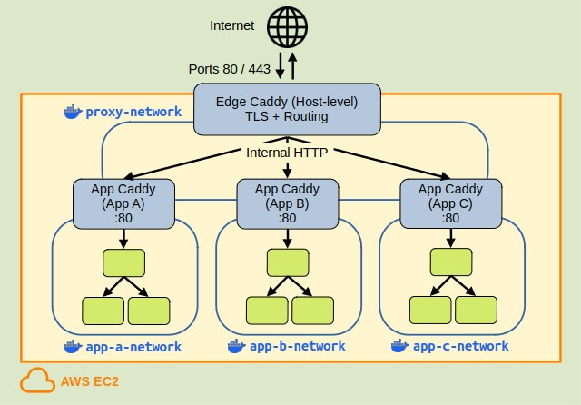

A full-stack ticket booking application using React + TypeScript (frontend), Spring Boot and Java (backend), and MySQL (database). 

The system uses a microservices architecture, where each service runs in its own **Docker container**.

Frontend and backend communicate via REST APIs through a **Gateway API**.
Microservices communicate via **Kafka events** and internal **REST calls**.

A **Caddy web server** serves a static React application and reverse proxies API requests to the Gateway API service.

**Cloud deployment** to **AWS EC2**.

**CI/CD** pipeline via **GitHub Actions**: deployment workflow runs when code is pushed to main.

## Application Architecture



#### Key components:

- **Frontend**: Built with **React** + **TypeScript**
- **Backend**: Microservices powered by **Spring Boot** and **Java**
- **Database**: **MySQL** for persistent data storage

#### Microservices breakdown:

* **gatewayapi:** Routes frontend and external API traffic to appropriate services
* **catalog-service:** Manages the catalog of events and venues stored in **MySQL**
* **cart-service:** Handles user carts using **Redis** for in-memory caching
* **order-service:** Processes orders and payments, interfacing with **MySQL**

#### Infrastructure services:

* **MySQL:** Data persistence
* **Redis:** Acts as an in-memory cache for cart data
* **Kafka + Zookeeper + Schema Registry:** Event-driven communication backbone
* **Caddy:** Serves frontend + reverse-proxies backend

All services are connected via a shared Docker network. Deployed using Docker Compose.


## Backend Directory Structure

Multi-module Maven project using a library of shared DTOs

```
backend/
├── pom.xml                      # Parent POM (packaging=pom)
├── ticketing-common-library/    # Shared DTOs
│       └── pom.xml
└── gatewayapi/                  # API gateway for frontend & routing
│       └── pom.xml
├── catalog-service/             # Event catalog microservice
│       └── pom.xml
├── cart-service/                # Shopping cart microservice
│       └── pom.xml
└── order-service/               # Order and payment microservice
        └── pom.xml
```


## Architecture & Data Flow

- Client keeps a local cartId in localStorage with cartId and a local copy of items for instant UI.
- Server exposes APIs: createCart, getCart(cartId), saveCartItem(cartId, item), deleteCartItem(cartId, item), checkout(cartId).
- On saveCartItem, createCart on server if needed and persist cartId locally.
- Server stores cart in Redis for fast reads.

- Server treated as source of truth: price and availability validated at checkout and when presenting totals.
- Items not reserved on saveCartItem, only at checkout
- Abandoned cart TTL: server expires carts after some time.


## Purchase Flow
Ticket purchase request flow through the system. Each service communicates via Kafka events to ensure reliable and decoupled processing.

1) Frontend (`/cart`) → Cart Service (HTTP - `POST cart checkout`)
    
   → emit `OrderCreationRequested`

2) Order Service consumes
- Check cart not already processed
- Save Order(`VALIDATING`)

  → emit `ReserveInventory`

3) Catalog Service consumes
- Checks availability and updates stock

  → emit `InventoryReservationResponse`

4) Order Service consumes
- If success: update Order(`PENDING_PAYMENT`)  
- If invalid: update Order(`INVALID`) 
- If fail: update Order(`FAILED`)  
  → emit `OrderCreationResponse`

5) Cart Service consumes
- Update cart/order status

6) Frontend Cart Update
  - Poll `/cart/{cartId}`
  - If status = `PENDING_PAYMENT` → redirect to `/checkout/{orderId}` for payment
  - If status = `INVALID` → redirect to `/cart` and point out invalid items

See [FRONTEND.md](documentation/FRONTEND.md) for full frontend details.


## Microservice Structure

- **Controller**: Handles incoming HTTP requests, maps them to service methods, and returns responses. Defines API endpoints.
- **Entity**: Represents a table in the database. Each entity is a Java class annotated for ORM (e.g., JPA/Hibernate).
  - **JPA (Java Persistence API)**: A specification for managing relational data in Java applications. It defines how Java objects are mapped to database tables.
  - **ORM (Object-Relational Mapping)**: A technique that lets you interact with a database using objects instead of SQL queries. Frameworks like Hibernate implement ORM and JPA.
- **Repository**: Provides CRUD operations for entities. Interfaces typically extend JPARepository or similar.
- **Service**: Contains business logic and interacts with repositories. Called by controllers to process requests.
- **Response**: Defines the structure of data sent back to the frontend, often as DTOs (Data Transfer Objects) for API responses.
- **JDBC (Java Database Connectivity)**: A standard Java API for connecting and executing queries with relational databases using SQL. JDBC provides low-level access to the database and is often used directly or by ORM frameworks.

#### Java Project Dependencies

- **spring-boot-starter-web**: For building RESTful web applications.
- **spring-boot-starter-data-jpa**: For ORM and database access.
- **mysql-connector-j**: MySQL database driver.
- **flyway-core** and **flyway-mysql**: For database migrations.
- **lombok**: Generates boilerplate via annotations.
- **spring-kafka**: Spring Kafka integration for event-driven messaging.
- **spring-boot-starter-data-redis**: Redis support.
- **jakarta.validation-api** and **hibernate-validator**: Bean Validation API and implementation.

## Spring Boot Actuator (in dev mode)

- `http://localhost:8000/actuator/gateway/routes` — View all routes currently configured in the API Gateway, including their IDs, predicates, and target URIs.


## API Endpoints

### API Documentation (Swagger / OpenAPI)

The public endpoints are exposed via the Gateway API using Swagger UI. 

- Public API Swagger UI:
  - dev: **https://localhost/swagger-ui.html**
  - prod: **https://api.ticket-booking.dorukemre.dev/swagger-ui.html**

Internal microservices APIs are not expose through the gateway for public documentation. 

### API Tests (Bruno)

The `api-tests` folder contains Bruno (API client) collections for testing the REST APIs of all backend services.


## Hosting on AWS EC2

- Add frontend url to CORS_ALLOWED_ORIGINS in `.env` file
- Build frontend with backend api url as VITE_API_BASE_URL, see `Makefile`
- Ensure security group of EC2 instance allows HTTP (port 80) and/or HTTPS (port 443) traffic
- Update site Caddyfile (Caddyfile.prod) to use the EC2 public DNS or IP instead of `localhost`.

### Central proxy Caddy

The AWS EC2 instance is running an edge proxy Caddy that binds ports 80/443 and handles all TLS certificates and HTTPS termination.
- Routes by hostname to per-app Caddy containers over a shared Docker network `proxy-network`
- Each app Caddy terminates internal HTTP and routes to its own frontend/API services via its private Docker `app-network`.
- App networks are isolated; only app Caddies are connected to the shared proxy network.



### Inbound rules

Anyone can reach EC2 via ports 80 and 443.
Restrict SSH to my IP + key-based auth.
ICMP for ping/traceroute for diagnostics.

| Type  | Protocol | Port | Source    | Purpose                         |
| ----- | -------- | ---- | --------- | ------------------------------- |
| HTTP  | TCP      | 80   | 0.0.0.0/0 | Public HTTP (redirect to HTTPS) |
| HTTPS | TCP      | 443  | 0.0.0.0/0 | Public HTTPS (production)       |
| SSH   | TCP      | 22   | my.ip/32  | Admin access only               |
| ICMP  | All      | -    | my.ip/32  | Optional diagnostics            |

## CI / CD

- CI/CD is implemented with GitHub Actions. 
- Pushes to `main` trigger the deployment workflow.
- The workflow:
  - Detects frontend/backend changes 
  - Configures AWS credentials via AWS OIDC to assume an AWS role 
  - Runs remote commands on EC2 via AWS SSM to update the repo and trigger local build/deploy steps.
  - Make targets invoked on the instance are defined in [Makefile](Makefile):
    - `update_repo`: Pulls latest changes from origin/main.
    - `deploy_frontend`: Updates repo and rebuilds static frontend.
    - `deploy_backend`: Updates repo, and rebuilds and restarts backend services.

Required GitHub secrets:
- AWS_ACCOUNT_ID
- AWS_REGION
- SSM_INSTANCE_IDS

## How to Run

### Dev Mode

Run the application using docker-compose.dev.yml with:

``` bash
make dev
```

#### Frontend

- React app runs in a Docker container
- The ./frontend directory is mounted to /app in the container, allowing live code updates
- Served using the Vite development server
- Accessible on port 5173: http://localhost:5173

#### Backend

- Builds the common library
- Each microservice runs in a Docker container using Maven: `mvn spring-boot:run`
- Accessible at: https://localhost:443

### Prod Mode

Run the application using docker-compose.prod.yml with:

``` bash
make prod

make prod_detached # for detached background
```

#### Frontend

- React app is built statically and served by Caddy
- https://ticket-booking.dorukemre.dev/

#### Backend

- Builds Java artifacts for all services
- Each microservice Dockerfile runs the service using `java -jar app.jar`
- https://api.ticket-booking.dorukemre.dev/

### Local Prod Mode

To simulate production locally, run the application using both docker-compose.prod.yml and docker-compose.localprod.yml with:

``` bash
make local_prod
```

`docker-compose.localprod.yml` overrides `docker-compose.prod.yml` to use `Caddyfile.localprod` to serve frontend at https://localhost:5443 and backend at https://localhost:8443